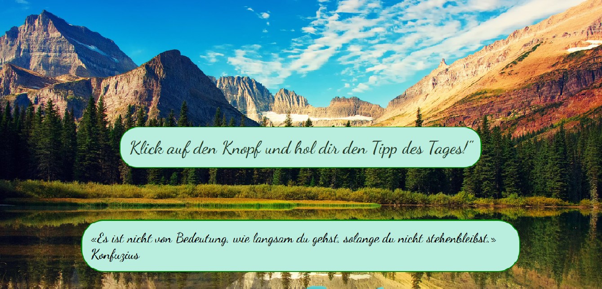

📘 Quote of the Day App

This is a simple web app that shows a random motivational quote in German when the user clicks a button.

Please open the app here: 

DEMO

🚀 Features

Displays a random quote each time the button is clicked

Responsive design (mobile-friendly)

Beautiful background and Google Fonts for a calm, inspirational vibe

Built using HTML, CSS, and JavaScript

🛠️ Technologies Used

HTML5

CSS3 (with responsive design using media queries)

JavaScript

API Integration

Google Fonts

💡 How to Use

Clone the repository or download the files

Open index.html in your browser

Click the button to get a new quote!

📌 License This project is open-source and available under the MIT License.

This project was created as part of a learning exercise and is intended for educational use only. 

Feel free to ask questions or suggest improvements!
